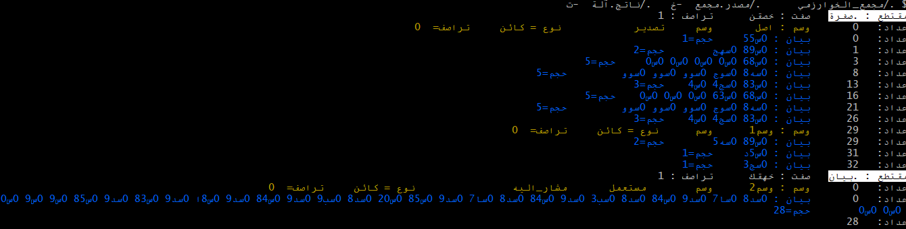

# مجمع الخوارزمي : تحدث مع المعالج مباشرة بالعربية
### أول   لغة تجميع عربية ... وأيضا مكتوب بلغة برمجة عربية
---


## نبذة عن المشروع
هذا المشروع هو أول مجمّع (Assembler) باللغة العربية. وهو أيضا مكتوب بالكامل بلغة البرمجة الخوارزم. 
يتيح هذا المجمّع كتابة برامج بلغة التجميع باستخدام مفردات عربية خالصة، ويدعم معمارية x86 وتوليد ملفات ELF32 القابلة للتنفيذ على أنظمة لينكس وويندوز.


**منذ 2010**	:	 الخورازم تنتج لغة مجمع  ، يتم تجميعها عن طريق أي مجمع متاح ثم يتم ربط لغة الآلة المجمع بالنظام المستهدف

مصدر الخوارزم ⟵ مصدر لغة المجمع  ```` (mov %ax,%bx)```` ⟵ تجميع الى لغة الآلة  ```` 01010101010   ````     ⟵ ربط بالنظام المستهدف	
            
**الآن**      :    الخوارزم تنتج لغة مجمع عربية، يتم تجميعها عن طريق مجمع الخوارزمي  ثم يتم ربط لغة الآلة المجمع بالنظام المستهدف

مصدر الخوارزم ⟵ مصدر لغة مجمع الخوارزمي ```` (نقل  	٪سم، ٪سق) ```` ⟵ تجميع الى لغة الآلة ```` 01010101010````⟵ ربط بالنظام المستهدف	

وبالتالي   أصبحنا نتحدث إلى المعالج باللغة العربية دون مترجم. حيث أن المعالج لا يفهم سوى لغة  ```` 01010101 ````  

الآن لدينا  : لغة الخوارزم (عربية) ⟵ لغة مجمع الخوارزمي (عربية) ⟵ لغة المعالج  ````  0101000100)    ````

كما يمكن الكتابة بلغة المجمع مباشرة :
 
لغة مجمع الخوارزمي (عربية) ⟵ لغة المعالج  ````  0101000100)    ````

يتحدث العربية من أعلى مستوى (اللغة البرمجية) إلى أدنى مستوى (لغة الآلة).


---


##  الأمثلة  
 
 مجمع_الخوارزمي/أمثلة/
 
 
### التجميع والتشغيل

# إنشاء الملف المصدري للغة المجمع من لغة الخوارزم باستعمال مترجم الخوارزم  (خوارزم)

```bash
./خوارزم -هدف=x86   -م"اصل.خ" مصدر.مجمع
````

# إنشاء ملف الآلة : تجميع الملف المصدري للغة المجمع عبر مجمع الخوارزمي  (مجمع_الخوارزمي)

```bash
./مجمع_الخوارزمي      ./مصدر.مجمع  -خ   ./ناتج.آلة
````




# الربط مع النظام ب  gcc أو clang

يقوم رابط النظام بربط ملفات المكونة فقط من لغة الآلة (0101010101..)  مع النظام لإنشاء برنامج قابل للتنفيذ على هذا الأخير.

````


gcc  ناتج.آلة   شاشة.مكتبة -o منتج.exe

````
 
# تشغيل البرنامج
````
./منتج
````

#إذا لم يدعم gcc على ويندوز الحروف العربية عند الربط يمكن استعمال :

````
cat ناتج.آلة > a.out

gcc  a.out lib.o -o out.exe
````

 
--- 
## المميزات

- ✅ كتابة تعليمات المعالج بالعربية الخالصة
- ✅ دعم كامل لسجلات x86 بأسماء عربية
- ✅ دعم التوجيهات العربية
- ✅ توليد ملفات كائن ELF32
- ✅ دعم التموقعات (Relocations) للربط الخارجي
- ✅ مكتوب بالكامل بلغة **الخوارزم** العربية
- ✅ مفتوح المصدر
   
---
 ## الحالة
- ✅  تجميع x86
- ✅   الى  ELF32
- [ ] دعم 64-bit (قيد التطوير)
- [ ] دعم كل تعليمات x86 (قيد التطوير) 

 ---

## المتطلبات

- مترجم لغة الخوارزم. وهو مرفق في  مجمع_الخوارزمي/أمثلة/

- `gcc` للربط النهائي  أو `clang`. يمكن استخدام mingw32 على ويندوز
- نظام لينكس أو ويندوز (32 بت أو 64 بت مع دعم 32 بت)

---
---


## جدول السجلات العربية

### سجلات 8 بت

| العربي | الإنجليزي | الرقم | الوصف |
|:------:|:---------:|:-----:|-------|
| `%مس` | `%al` | 0 | البايت السفلي من المراكم - Accumulator Low |
| `%عس` | `%cl` | 1 | البايت السفلي من سجل العدّ - Count Low |
| `%بس` | `%dl` | 2 | البايت السفلي من سجل البيانات - Data Low |
| `%قس` | `%bl` | 3 | البايت السفلي من سجل القاعدة - Base Low |

### سجلات 16 بت

| العربي | الإنجليزي | الرقم | الوصف |
|:------:|:---------:|:-----:|-------|
| `%سم` | `%ax` | 0 | سجل المراكم - Accumulator Register |
| `%سع` | `%cx` | 1 | سجل العَدّ - Count Register |
| `%سب` | `%dx` | 2 | سجل البيانات - Data Register |
| `%سق` | `%bx` | 3 | سجل القاعدة - Base Register |
| `%مم` | `%si` | 6 | مؤشر المصدر - Source Index |
| `%مو` | `%di` | 7 | مؤشر الوجهة - Destination Index |

### سجلات 32 بت

| العربي | الإنجليزي | الرقم | الوصف |
|:------:|:---------:|:-----:|-------|
| `%سمم` | `%eax` | 0 | سجل التراكم الموسع - Extended Accumulator |
| `%سعم` | `%ecx` | 1 | سجل العدّ الموسّع - Extended Count |
| `%سبم` | `%edx` | 2 | سجل البيانات الموسع - Extended Data |
| `%سقم` | `%ebx` | 3 | سجل القاعدة الموسع - Extended Base |
| `%ممم` | `%esp` | 4 | مؤشر المكدس الموسع - Extended Stack Pointer |
| `%مقم` | `%ebp` | 5 | مؤشر القاعدة الموسع - Extended Base Pointer |
| `%فمم` | `%esi` | 6 | فهرس المصدر الموسع - Extended Source Index |
| `%فهم` | `%edi` | 7 | فهرس الهدف الموسع - Extended Destination Index |

### سجلات 64 بت


### سجلات النقطة العائمة

| العربي | الإنجليزي | الوصف |
|:------:|:---------:|-------|
| `%قم` | `%st` | قمة مكدس النقطة العائمة - Stack Top |

---

## التوجيهات العربية

| العربي | الإنجليزي | الوصف |
|:------:|:---------:|-------|
| `.مقتطع` | `.section` | تحديد مقتطع |
| `.صفرة` | `.text` | مقتطع الصفرة |
| `.بيان` | `.data` | مقتطع البيانات |
| `.سلسلة` | `.string` | سلسلة نصية منتهية بصفر |
| `.عام` | `.global` | رمز عام مُصدَّر |
| `.خارجي` | `.extern` | رمز خارجي مستورد |
| `.قطعة` | `.byte` | بيانات بايت |

---

## التعليمات العربية

| العربي | الإنجليزي | الوصف |
|:------:|:---------:|-------|
| `نقل` | `mov` | نقل البيانات |
| `دفع` | `push` | دفع إلى المكدس |
| `سحب` | `pop` | سحب من المكدس |
| `استدع` | `call` | استدعاء دالة |
| `رجع` | `ret` | العودة من دالة |
| `ضف` | `add` | جمع |
| `طرح` | `sub` | طرح |
| `قارن` | `cmp` | مقارنة |
| `قفز` | `jmp` | قفز غير مشروط |
| `قفزص` | `jl` | قفز إذا أصغر |
| `و` | `and` | AND منطقي |
| `او` | `or` | OR منطقي |
| `ام` | `xor` | XOR منطقي |


## معمارية المعالج x86
<p dir="rtl">

```text
┌─────────────────────────────────────────────────────────────────────────┐
│                        معالج x86 - 32 بت                                  │
├─────────────────────────────────────────────────────────────────────────┤
│                                                                         │
│   سجلات الأغراض العامة (32 بت)                                               │
│   ┌──────────────────────────────────────────────────────────────────┐  │
│   │                                                                  │  │
│   │  سمم (EAX)                                                        │  │
│   │  ┌─────────────────────┬────────────┬────────────┐               │  │
│   │  │ 31               16 │ 15       8 │ 7        0 │               │  │
│   │  │    الجزء العلوي         │     (AH)   │   مس(AL)   │               │  │
│   │  └─────────────────────┴────────────┴────────────┘               │  │
│   │  سجل التراكم الموسع - Extended Accumulator (EAX)                       │  │
│   │                                                                  │  │
│   │  سعم (ECX)                                                        │  │
│   │  ┌─────────────────────┬────────────┬────────────┐               │  │
│   │  │ 31               16 │ 15       8 │ 7        0 │               │  │
│   │  │    الجزء العلوي         │     (CH)   │   عس(CL)   │               │  │
│   │  └─────────────────────┴────────────┴────────────┘               │  │
│   │  سجل العدّ الموسّع - Extended Count (ECX)                              │  │
│   │                                                                  │  │
│   │  سبم (EDX)                                                        │  │
│   │  ┌─────────────────────┬────────────┬────────────┐               │  │
│   │  │ 31               16 │ 15       8 │ 7        0 │               │  │
│   │  │    الجزء العلوي         │    (DH)    │   بس(DL)   │               │  │
│   │  └─────────────────────┴────────────┴────────────┘               │  │
│   │  سجل البيانات الموسع - Extended Data (EDX)                             │  │
│   │                                                                  │  │
│   │  سقم (EBX)                                                        │  │
│   │  ┌─────────────────────┬────────────┬────────────┐               │  │
│   │  │ 31               16 │ 15       8 │ 7        0 │               │  │
│   │  │    الجزء العلوي        │    (BH)     │   قس(BL)   │               │  │
│   │  └─────────────────────┴────────────┴────────────┘               │  │
│   │  سجل القاعدة الموسع - Extended Base (EBX)                             │  │
│   │                                                                  │  │
│   └──────────────────────────────────────────────────────────────────┘  │
│                                                                         │
│      سجلات المؤشر والفهرس (32 بت)                                           │
│   ┌──────────────────────────────────────────────────────────────────┐  │
│   │                                                                  │  │
│   │  ممم (ESP) - مؤشر المكدس الموسع                                       │  │
│   │  ┌────────────────────────────────────────────┐                  │  │
│   │  │ 31                                       0 │                  │  │
│   │  │          Extended Stack Pointer            │ ◄── ممم           │  │
│   │  └────────────────────────────────────────────┘                  │  │
│   │                          │                                       │  │
│   │                          ▼                                       │  │
│   │            ┌────────────────────────────┐                        │  │
│   │            │  قمة المكدس    ◄──── ممم      │ عنوان أعلى                │  │
│   │            ├────────────────────────────┤                        │  │
│   │            │      دفع %مقم                │                        │  │
│   │            ├────────────────────────────┤                        │  │
│   │            │      متغيرات محلية             │                        │  │
│   │            ├────────────────────────────┤                        │  │
│   │            │  قاعدة الإطار  ◄──── مقم        │                        │  │
│   │            ├────────────────────────────┤                        │  │
│   │            │      معاملات                 │                        │  │
│   │            └────────────────────────────┘ عنوان أدنى                │  │
│   │                                                                  │  │
│   │         مقم (EBP) - مؤشر القاعدة الموسع                                 │  │
│   │  ┌────────────────────────────────────────────┐                  │  │
│   │  │ 31                                       0 │                  │  │
│   │  │           Extended Base Pointer            │                  │  │
│   │  └────────────────────────────────────────────┘                  │  │
│   │                                                                  │  │
│   │       فمم (ESI) - فهرس المصدر الموسع                                  │  │
│   │  ┌────────────────────────────────────────────┐                  │  │
│   │  │ 31                                       0 │                  │  │
│   │  │          Extended Source Index             │                  │  │
│   │  └────────────────────────────────────────────┘                  │  │
│   │                          │                                       │  │
│   │           │ عمليات السلاسل                                           │  │
│   │                          ▼                                       │  │
│   │       فهم (EDI) - فهرس الهدف الموسع                                   │  │
│   │  ┌────────────────────────────────────────────┐                  │  │
│   │  │ 31                                       0 │                  │  │
│   │  │        Extended Destination Index          │                  │  │
│   │  └────────────────────────────────────────────┘                  │  │
│   │                                                                  │  │
│   └──────────────────────────────────────────────────────────────────┘  │
│                                                                         │
│      سجلات النقطة العائمة x87                                                  │
│   ┌──────────────────────────────────────────────────────────────────┐  │
│   │                                                                  │  │
│    │  قم=ST ──► قم(0)  ┌──────────────────────────────────────────┐    │  │
│    │                 │                قمة مكدس النقطة العائمة          │     │  │
│    │            قم(1) ├──────────────────────────────────────────┤    │  │
│    │            قم(2) ├──────────────────────────────────────────┤    │  │
│    │            قم(3) ├──────────────────────────────────────────┤    │  │
│    │            قم(4) ├──────────────────────────────────────────┤    │  │
│    │            قم(5) ├──────────────────────────────────────────┤    │  │
│    │            قم(6) ├──────────────────────────────────────────┤    │  │
│    │            قم(7) └──────────────────────────────────────────┘    │  │
│   │                                                                  │  │
│   └──────────────────────────────────────────────────────────────────┘  │
│                                                                         │
└─────────────────────────────────────────────────────────────────────────┘
```

 
---

> **بسم الله الرحمن الرحيم**
>
> هذا المشروع إسهام حضاري في مسيرة تعريب تقنية المعلومات،
> ويُثبت أن اللغة العربية قادرة على استيعاب أعمق مفاهيم
> علوم الحاسوب من مستوى الأجهزة وحتى مستوى التطبيقات.
